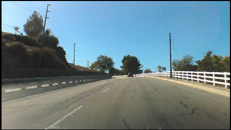
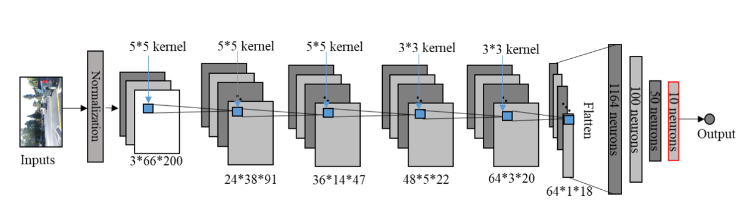
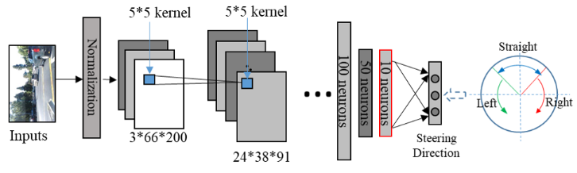

# Self Driving Car with Uncertain Data Analysis
If you find this code useful, please cite our paper **[Autonomous driving quality assurance with data uncertainty analysis](https://ieeexplore.ieee.org/abstract/document/9891977)** 
## Introduction
CNNs is widely using to build self-driving cars. Nvidia's Dave2,
 the model that using for autonomous cars, one of the easiest ways to build a Self-driving car. 
In the project, the Dave-2 system is implemented on Keras and used to predict steering angle. 
The Dave-2 dataset consists of 45,406 images that get from a camcorder in a real car ride.It was made by Sully Chen. You can download **[HERE](https://drive.google.com/file/d/0B-KJCaaF7elleG1RbzVPZWV4Tlk/view)**.
If you want to train your own model rather than using pretrained, just put the images to a data folder.  
 

## Model and Results

In the original project, Dave-2 model using road images as inputs and predict the vehicle controls (steering angle) as outputs. You can find the full paper **[HERE](https://arxiv.org/pdf/1604.07316.pdf)**  

 
Then, the self driving car runs as below  
 

While, considering the existing of uncertain data (e.g. corner cases) in real operation,
AI systems are not trustful always. To avoid AI making wrong decision to cause accidents, 
we propose to introduce data uncertainty analysis in AIs in our paper (**[HERE](https://ieeexplore.ieee.org/abstract/document/9891977)**). Meanwhile, a new model with modification on the the original paper is constructed, as below  

 
Process of self driving with warning of uncertain data  
 

# How To Run

You can either use pretrained model or train your own. 

Note: Because of the largeness of the dataset, you may need high compute resources for training.

If you want to run the orininal self driving on test set:   
 `python3 run.py` and setting corner case warning `cc_warning=False` 

If you want to run self driving with uncertain data warning:   
 `python3 run.py` and setting corner case warning `cc_warning=True` 

# Related Works -Source

-https://arxiv.org/pdf/1604.07316.pdf

-https://github.com/adityaguptai/Self-Driving-Car-

-https://github.com/tech-rules/DAVE2-Keras

-https://github.com/berkcomba/Self-Driving-Car-Keras

